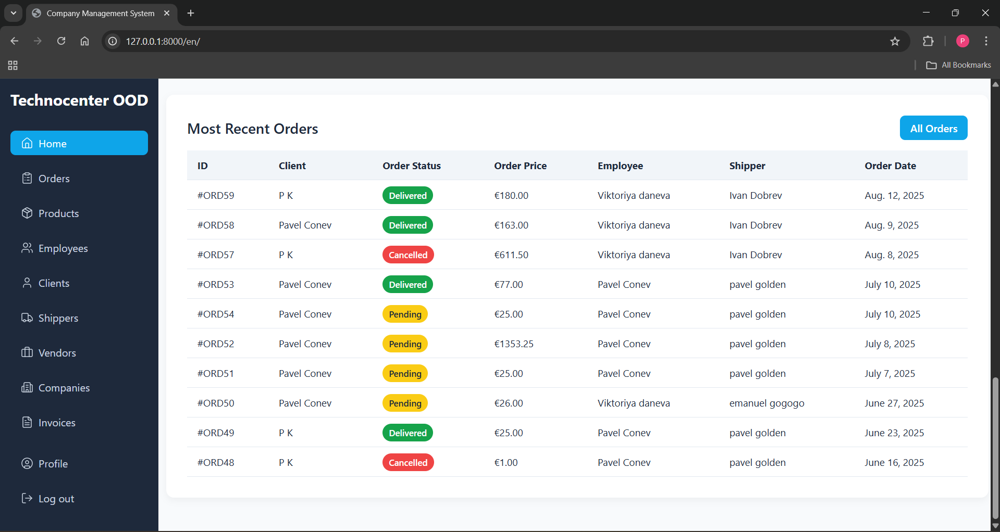

# Company Management System

A Django-based web application for managing companies, clients, employees, vendors, shippers, products, orders, and invoices.  

---

## 🚀 Features

- **User Management** – registration, login, profile editing, password changes, and role-based permissions.  
- **Clients, Employees, Vendors, Shippers** – add, edit, delete, and view participants in the company.  
- **Orders & Invoices** – create and manage customer orders, generate invoices, apply discounts and VAT.  
- **Products** – manage product catalog with attributes like name, price, weight, and vendor.  
- **Search & Filtering** – search bar for all modules, plus custom filters for orders and invoices.  
- **Reports & Charts** – visual representation of delivered orders in the last 12 months (Chart.js).  
- **Responsive Frontend** – built with Django Template Language (DTL), JavaScript, Select2, and Lucide icons.  

---

## 🛠️ Tech Stack

- **Backend**: Django 5.x, Django ORM, PostgreSQL  
- **Frontend**: Django Templates, HTML, CSS, JavaScript  
- **Libraries**: django-select2, Chart.js, Lucide Icons  
- **Other Tools**: PyCharm, Git, Docker (optional for deployment)  

---

## ⚙️ Installation

1. Clone the repository:
   ```bash
   git clone https://github.com/your-username/company-management-system.git
   cd company-management-system

2. Create and activate a virtual environment:
   ```bash
   python -m venv .venv
   .venv/scripts/activate
   
3. Install dependencies:
   ```bash
   pip install -r requirements.txt

4. Set up PostgreSQL database in main folder(diplomna_rabota) settings.py:
DATABASES = {
    'default': {
        'ENGINE': '...',
        'NAME': '...',
        'USER': '...',
        'PASSWORD': '...',
        'HOST': '...',
        'PORT': '...'
    }
}

5. Apply migrations:
   ```bash
   python manage.py makemigrations
   python manage.py migrate

6. Create a superuser (admin account):
   ```bash
   python manage.py createsuperuser

7. Run developement server:
   ```bash
   python manage.py runserver

8. Access the app at http://localhost:8000
   
---
## 🖼️ Screenshots
<p align="center">
  
  
  
   
   
   
   
</p>

